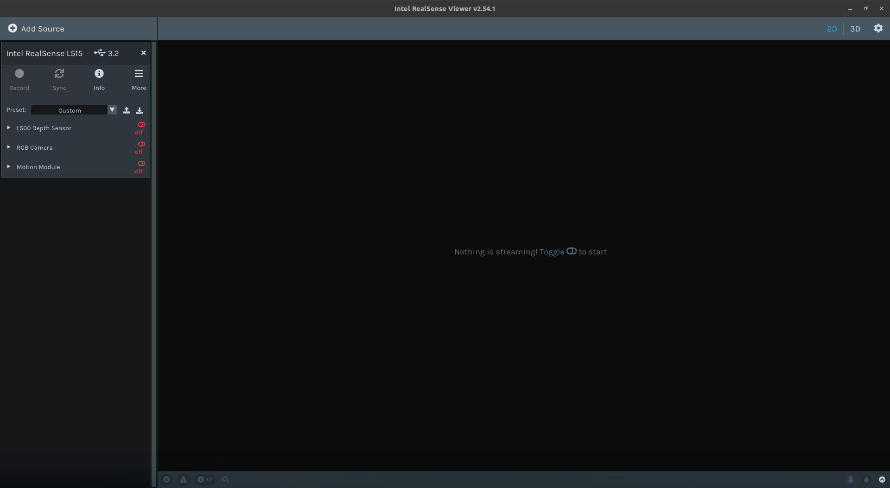
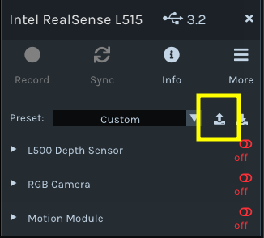
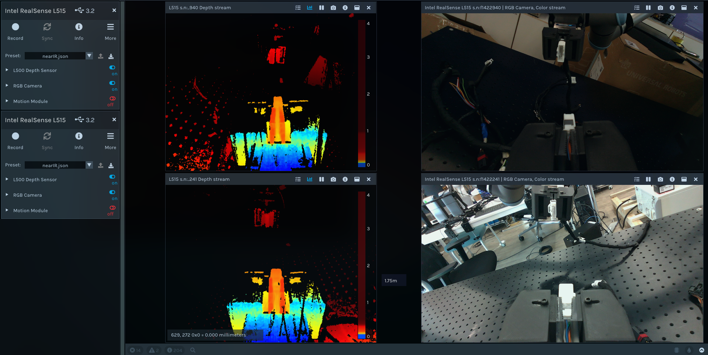
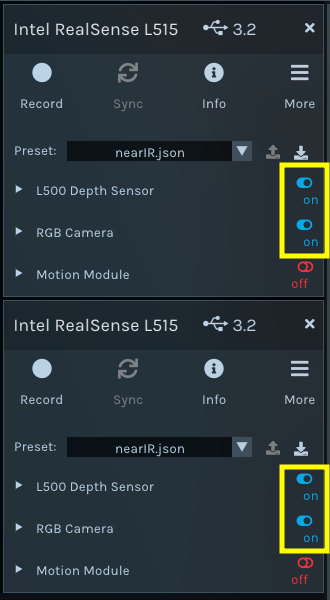
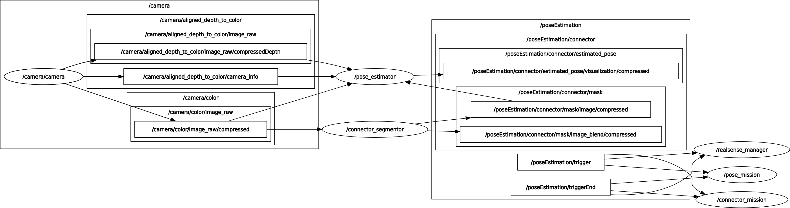
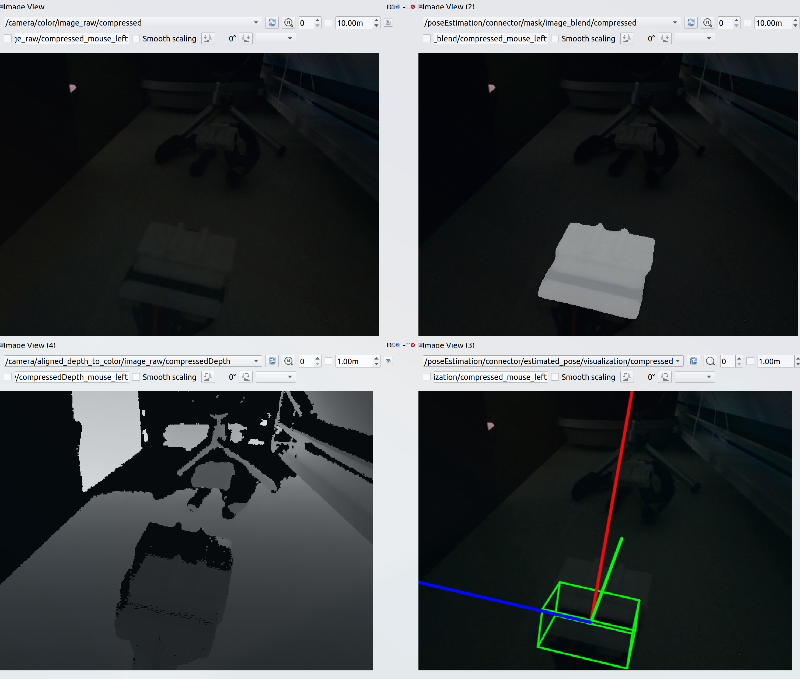

# Hyundai-NGV : Ground and Track Arbitarily Vehicle Connector

**[KAIST-IRIS Lab / Autnomous Platform Team](https://iris.kaist.ac.kr)**  
Vision Team Leader: Sangmin Lee, Ph.D IRiS Lab / iismn@kaist.ac.kr  
Teammate:Handong Lee, M.S. IRiS Lab / hdong564@kaist.ac.kr

## <span style="color:yellow"> Basic Highlights </span> 

Overall Instruction of Connector Pose Estimation.  

#### Required Env
> Ubuntu >= 22.04 LTS  
NVIDIA Driver >= 535  
ROS2 >= Humble

#### Tested Env
> Ubuntu 22.04 LTS  
NVIDIA Driver 560.35.03  
ROS2 Humble  
#### Computing Env
>CPU - Intel i9-13900K  
RAM - 64GB DDR5  
SSD - NVME 2TB  
VGA - NVIDIA RTX A6000 Ada  

## <span style="color:yellow"> Installation </span> 

#### 0. Outside of Docker Container
0-A, Setting up Docker, nvidia-docker, ROS2  
>Docker install : https://docs.docker.com/engine/install/  
Nvidia-Docker install : https://docs.nvidia.com/datacenter/cloud-native/container-toolkit/latest/install-guide.html  
ROS2 : https://docs.ros.org/en/humble/Installation.html


0-B, Main PC need to set env param ROS_DOMAIN_ID to communicte ROS2 and set rtps udp profile.
```bash
export ROS_DOMAIN_ID=10       
export FASTRTPS_DEFAULT_PROFILES_FILE=$YOUR_RTPS_PROFILE_PATH/rtps_udp_profile.xml
```
*rtps_udp_profile.xml*
```xml
<?xml version="1.0" encoding="UTF-8" ?>

<!--
Copyright (c) 2022, NVIDIA CORPORATION.  All rights reserved.

NVIDIA CORPORATION and its licensors retain all intellectual property
and proprietary rights in and to this software, related documentation
and any modifications thereto.  Any use, reproduction, disclosure or
distribution of this software and related documentation without an express
license agreement from NVIDIA CORPORATION is strictly prohibited.
-->

<license>NVIDIA Isaac ROS Software License</license>
<profiles xmlns="http://www.eprosima.com/XMLSchemas/fastRTPS_Profiles" >
    <transport_descriptors>
        <transport_descriptor>
            <transport_id>UdpTransport</transport_id>
            <type>UDPv4</type>
            <maxInitialPeersRange>400</maxInitialPeersRange>
        </transport_descriptor>
    </transport_descriptors>

    <participant profile_name="udp_transport_profile" is_default_profile="true">
        <rtps>
            <userTransports>
                <transport_id>UdpTransport</transport_id>
            </userTransports>
            <useBuiltinTransports>false</useBuiltinTransports>
        </rtps>
    </participant>
</profiles>
```
#### 1. Pull Docker Environmetn Image. Docker image contain all of neccesary package [Ubuntu, CUDA, ROS2, PyTorch, ...]

```bash
docker pull iismn/env_hyundai_ngv:GrndSAM-2
docker pull iismn/env_hyundai_ngv:FndPose
```
#### 2. Generate docker container (Connector Segmentor, Pose Estimator) by
2-A. Connector Segmentor
```bash
sudo docker run -it \   
    --name=connectorSegmentor \
    --gpus=all \
    --env="DISPLAY=$DISPLAY" \
    --env="QT_X11_NO_MITSHM=1" \
    --volume="/tmp/.X11-unix:/tmp/.X11-unix:rw" \
    --env="XAUTHORITY=$XAUTH" \
    --env NVIDIA_DRIVER_CAPABILITIES=compute,utility \
    --volume="$XAUTH:$XAUTH" \
    --runtime=nvidia \
    -v /home/$USER/Workspace/:/home/$USER/Workspace/ \
    -v /dev:/dev\
    -v /dev/shm:/dev/shm\
    --privileged\
    --net=host \
    --ipc=host \
    --pid=host \
    iismn/env_hyundai_ngv:GrndSAM-2
```
2-B. Connector Pose Estimator
```bash
sudo docker run -it \
    --name=connectorPose \
    --gpus=all \
    --env="DISPLAY=$DISPLAY" \
    --env="QT_X11_NO_MITSHM=1" \
    --volume="/tmp/.X11-unix:/tmp/.X11-unix:rw" \
    --env="XAUTHORITY=$XAUTH" \
    --env NVIDIA_DRIVER_CAPABILITIES=compute,utility \
    --volume="$XAUTH:$XAUTH" \
    --runtime=nvidia \
    -v /home/$USER/Workspace/:/home/$USER/Workspace/ \
    -v /dev:/dev\
    -v /dev/shm:/dev/shm\
    --privileged\
    --net=host \
    --ipc=host \
    --pid=host \
    iismn/env_hyundai_ngv:FndPose
```
#### 3. Export ROS_WS Env Param to zsh
At each container, you need to parameterize your folder directory as,
```bash
# Example: export ROS_WS=/home/iris/Workspace/ROS2/
export ROS_WS='YOUR DIRECTORY PWD HERE'
```

## <span style="color:yellow"> ROS2 Execution (DPT Sensor - Intel® RealSense L515) </span> 
### **Pre-Requirement -**<span style="color:red"> ***Intel® RealSense SDK NEED TO BE INSTALLED*** </span>  

> ⚠️ **IMPORTANT:** Intel® RealSense SDK Installation [OUTSIDE OF DOCKER]
> 
> SDK / ROS Version Requirement <span style="color:red">**(VERSION IS IMPORTANT)**</span>  
> - **Intel® RealSense SDK - 2.50.0**  
> - **Intel® RealSense ROS Branch - 4.51.1**  
> 
> Please refer to [Compiling LibRealSense for Linux Ubuntu Guide](https://dev.intelrealsense.com/docs/compiling-librealsense-for-linux-ubuntu-guide)
> 
> **⚠️ CAUTION:** When SDK / ROS Branch versions are different, L515 DPT sensor will not work properly.

#### 1. ROS2 Source Build [INSIDE OF DOCKER]
Initialize Segmentor Container
```bash
sudo docker start connectorSegmentor && sudo docker exec -it connectorSegmentor /bin/zsh
```
Build provided source

```bash
# cd /$(ROS_WS)/
colcon build
source install/setup.zsh #(IF USING BASH, source install/setup.bash)
```


#### 2. Sensor Setup
Launch Intel® RealSense Viewer for configuring Intel® RealSense L515 Paramter

```bash
realsense-viewer
``` 
After launch realsense viewer, you can see viewer screen.



If L515 not detected, unmount L515 USB cable and re-plug to PC.
After connection, upload config file (NearIR.json) of L515. 



Configuration parameters `.json` for IR High Intensity - **Near IR**

```json
{
    "device": {
        "fw version": "01.05.08.01",
        "name": "Intel RealSense L515",
        "product line": "L500"
    },
    "parameters": {
        "Alternate IR": 0.0,
        "Apd Temperature": 37.5010833740234,
        "Confidence Threshold": 3,
        "Depth Offset": 4.5,
        "Depth Units": 0.000250000011874363,
        "Digital Gain": 1,
        "Enable IR Reflectivity": 0.0,
        "Enable Max Usable Range": 0.0,
        "Error Polling Enabled": 1,
        "Frames Queue Size": 16,
        "Freefall Detection Enabled": 1,
        "Global Time Enabled": 0.0,
        "Host Performance": 0.0,
        "Humidity Temperature": 40.6721611022949,
        "Inter Cam Sync Mode": 0.0,
        "Invalidation Bypass": 0.0,
        "LDD temperature": 46.1083450317383,
        "Laser Power": 91,
        "Ma Temperature": 41.2509956359863,
        "Mc Temperature": 39.6253890991211,
        "Min Distance": 0.0,
        "Noise Estimation": 1414,
        "Noise Filtering": 6,
        "Post Processing Sharpening": 3,
        "Pre Processing Sharpening": 5,
        "Receiver Gain": 18,
        "Sensor Mode": 0.0,
        "Visual Preset": 0.0
    },
    "schema version": 1,
    "viewer": {
        "stream-depth-format": "Z16",
        "stream-fps": "30",
        "stream-height": "480",
        "stream-ir-format": "Y8", 
        "stream-width": "640"
    }
}
```

####  <span style="color:red">[CAUTION]</span> **BOTH L515 NEED TO BE CONFIGURED**

After configuration, you need to check both camera operable.  
If not, please on / off RGB and depth until sensor operable.  

  

Before execute under sequence, L515 in realsense-viewer need to be turned off.   
(ON -> OFF. not have to turn off realsense-viewer)  

#### 3. Execute Launch File 
Build provided source

```bash
ros2 launch realsense_manage rs_multi_camera_mission_launch.py
```
#### Tip. Edit Parameters
You can edit parameters setting for detecting connector and text prompt in *_launch.py.  
Please set **RealSense serial_no** correspond to *UR16 Manipulator*.

  
> ```rs_multi_camera_mission_launch.py``` Parameters
```python
parameters = [{
      'camera1_launch_args': ['camera_name:=camera', 'serial_no:=f1422940', 'output:=log'],
      'camera2_launch_args': ['camera_name:=camera', 'serial_no:=f1422241', 'output:=log']
}]
```

## <span style="color:yellow"> ROS2 Execution (Connector Segmentor) </span> 
#### 0. Excute connectorPose docker container
```bash
sudo docker start connectorSegmentor && sudo docker exec -it connectorSegmentor /bin/zsh
```

#### 1. ROS2 Source Environment Setup
First, SAM2 / Grounding DINO need to be installed. Docker already provides the environment. But for stability, the installation process needs to be conducted once again.

```bash
# cd /$(ROS_WS)/src/connector_semantic_segment/segment_src/
pip install -e .
pip install --no-build-isolation -e grounding_dino
```

#### 2. ROS2 Source Build
Build provided source

```bash
# cd /$(ROS_WS)/
colcon build
source install/setup.zsh #(IF USING BASH, source install/setup.bash)
```

#### 3. Execute Launch File 
ROS2 Launch Connector Segmentor
```bash
ros2 launch connector_semantic_segment mission_launch.py
```
#### Tip. Edit Parameters
You can edit parameters setting for detecting connector and text prompt in *_launch.py  
Each connector need to be set different text prompt. *(Female, Male Connector)*

  
> ```mission_launch.py``` Parameters
```python
parameters = [{
    'segmentA_launch_args': ['text_prompt:=white plastic connector consist with grey part near by camera.'],
    'segmentB_launch_args': ['text_prompt:=white plastic connector consist with grey part far from camera.']
}]
```
## <span style="color:yellow"> ROS2 Execution (Connector Pose Estimator) </span> 
#### 0. Excute connectorPose docker container
```bash
sudo docker start connectorPose && sudo docker exec -it connectorPose /bin/zsh
```

#### 1. ROS2 Source Environment Setup
First, FoundationPose need to be installed. Docker already provides the environment. But for stability, the installation process needs to be conducted once again.

```bash
# cd /$(ROS_WS)/src/connector_pose_estimation/pose_src/
export PYTHONPATH=$(pwd)
export PYTHONPATH=$ROS_WS/src/connector_pose_estimation/pose_src/
```

#### 2. ROS2 Source Build
Build provided source

```bash
# cd /$(ROS_WS)/
colcon build
source install/setup.zsh #(IF USING BASH, source install/setup.bash)
```

#### 3. Execute Launch File 
Build provided source

```bash
ros2 launch connector_pose_estimation mission_launch.py
```
#### Tip. Edit Parameters
You can edit parameters setting for detecting connector and text prompt in *_launch.py  
Specify Male - Female Connecotor CAD File **(.obj / mm metric)**

*!! important !!*  
*Mesh (Obj) File need to be specified. If not, pose estimation can not be run.*

> ```mission_launch.py``` Parameters
```python
parameters = [{
    'poseEstmationA_launch_args': ['mesh_filename:=ConnectorB.obj'],
    'poseEstmationB_launch_args': ['mesh_filename:=ConnectorB.obj']
}]
```

## <span style="color:yellow"> Overall RQT Graph </span> 


### Main Node:
```bash 
realsense_camera_node   # DPT Sensor Driver
connector_segmentor     # Zero-shot Connector Segmentor
pose_estimator          # One-shot Connector Pose Estimator
```
### DPT Sensor Topic:
```bash 
/camera/aligned_depth_to_color/image_raw/compressedDepth    # Aligned Depth Sync with RGB Sensor
/camera/color/image_raw/compressed                          # Aligned RGB
```
### Visualization Topic:
```bash 
/poseEstimation/connector/estimated_pose/visualization/compressed   # Pose Estimation Result    (RGB Proj.)
/poseEstimation/connector/mask/image_blend/compressed               # Segment Result            (RGB Proj.)
```
### Final Pose Estimation Topic:
```bash 
/poseEstimation/connector/estimated_pose    # Estimated 6-DoF Pose Result (from L515 DPT Optical Frame)
```
### Trigger Topic:
```bash 
/poseEstimation/trigger         # Trigger: UR16 - Alice / Bob (Female Connector / Male Connector)
/poseEstimation/triggerEnd      # Trigger: Bool - True / False (Pose Estimation Sequence Done / Not Done)
```
*Trigger can test via following command:*
```bash 
ros2 topic pub --once /poseEstimation/trigger std_msgs/msg/String "{data: 'Alice'}"
ros2 topic pub --once /poseEstimation/trigger std_msgs/msg/String "{data: 'Bob'}"
ros2 topic pub --once /poseEstimation/triggerEnd std_msgs/msg/Bool "{data: true}"
```

## Citation

Check research about grounded segmentation algorithm and pose estimation
### Related Research Papers
1. "SAM 2: Segment Anything in Images and Videos" / Nikhila Ravi et al.
2. "Grounding DINO: Marrying DINO with Grounded Pre-training for Open-Set Object Detection" / Shilong Liu et al.
3. "Grounding DINO 1.5: Advance the 'Edge' of Open-Set Object Detection" / Tianhe Ren et al.
4. "Grounded SAM: Assembling Open-World Models for Diverse Visual Tasks" / Tianhe Ren et al.
5. "Segment Anything" / Alexander Kirillov et al.
6. "T-Rex2: Towards Generic Object Detection via Text-Visual Prompt Synergy" / Qing Jiang et al.**

```BibTex
@misc{ravi2024sam2segmentimages,
      title={SAM 2: Segment Anything in Images and Videos}, 
      author={Nikhila Ravi and Valentin Gabeur and Yuan-Ting Hu and Ronghang Hu and Chaitanya Ryali and Tengyu Ma and Haitham Khedr and Roman Rädle and Chloe Rolland and Laura Gustafson and Eric Mintun and Junting Pan and Kalyan Vasudev Alwala and Nicolas Carion and Chao-Yuan Wu and Ross Girshick and Piotr Dollár and Christoph Feichtenhofer},
      year={2024},
      eprint={2408.00714},
      archivePrefix={arXiv},
      primaryClass={cs.CV},
      url={https://arxiv.org/abs/2408.00714}, 
}

@article{liu2023grounding,
  title={Grounding dino: Marrying dino with grounded pre-training for open-set object detection},
  author={Liu, Shilong and Zeng, Zhaoyang and Ren, Tianhe and Li, Feng and Zhang, Hao and Yang, Jie and Li, Chunyuan and Yang, Jianwei and Su, Hang and Zhu, Jun and others},
  journal={arXiv preprint arXiv:2303.05499},
  year={2023}
}

@misc{ren2024grounding,
      title={Grounding DINO 1.5: Advance the "Edge" of Open-Set Object Detection}, 
      author={Tianhe Ren and Qing Jiang and Shilong Liu and Zhaoyang Zeng and Wenlong Liu and Han Gao and Hongjie Huang and Zhengyu Ma and Xiaoke Jiang and Yihao Chen and Yuda Xiong and Hao Zhang and Feng Li and Peijun Tang and Kent Yu and Lei Zhang},
      year={2024},
      eprint={2405.10300},
      archivePrefix={arXiv},
      primaryClass={cs.CV}
}

@misc{ren2024grounded,
      title={Grounded SAM: Assembling Open-World Models for Diverse Visual Tasks}, 
      author={Tianhe Ren and Shilong Liu and Ailing Zeng and Jing Lin and Kunchang Li and He Cao and Jiayu Chen and Xinyu Huang and Yukang Chen and Feng Yan and Zhaoyang Zeng and Hao Zhang and Feng Li and Jie Yang and Hongyang Li and Qing Jiang and Lei Zhang},
      year={2024},
      eprint={2401.14159},
      archivePrefix={arXiv},
      primaryClass={cs.CV}
}

@article{kirillov2023segany,
  title={Segment Anything}, 
  author={Kirillov, Alexander and Mintun, Eric and Ravi, Nikhila and Mao, Hanzi and Rolland, Chloe and Gustafson, Laura and Xiao, Tete and Whitehead, Spencer and Berg, Alexander C. and Lo, Wan-Yen and Doll{\'a}r, Piotr and Girshick, Ross},
  journal={arXiv:2304.02643},
  year={2023}
}

@misc{jiang2024trex2,
      title={T-Rex2: Towards Generic Object Detection via Text-Visual Prompt Synergy}, 
      author={Qing Jiang and Feng Li and Zhaoyang Zeng and Tianhe Ren and Shilong Liu and Lei Zhang},
      year={2024},
      eprint={2403.14610},
      archivePrefix={arXiv},
      primaryClass={cs.CV}
}
```